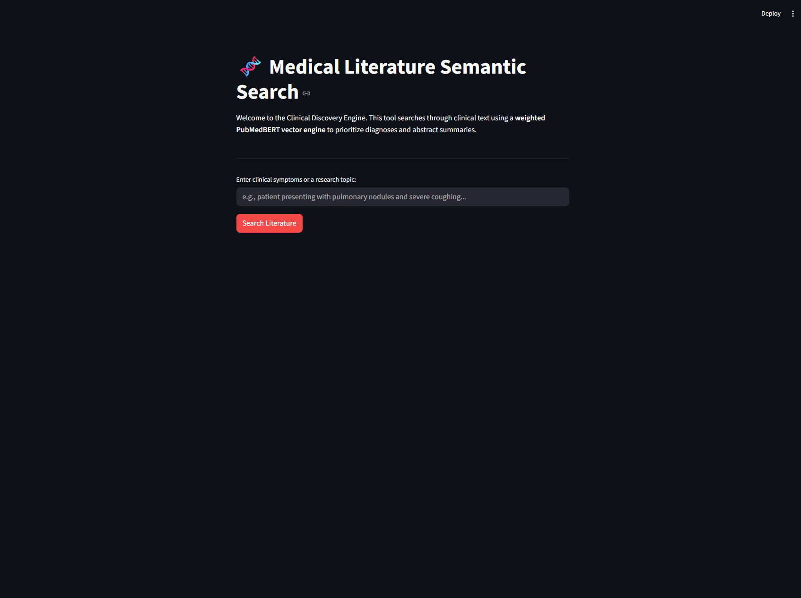
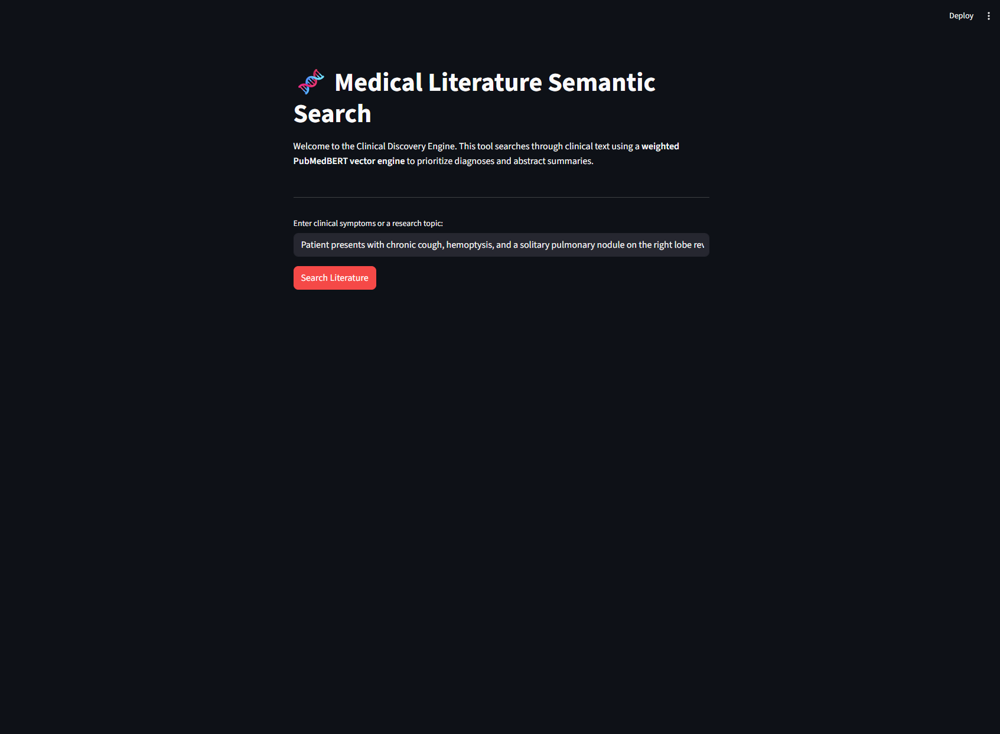
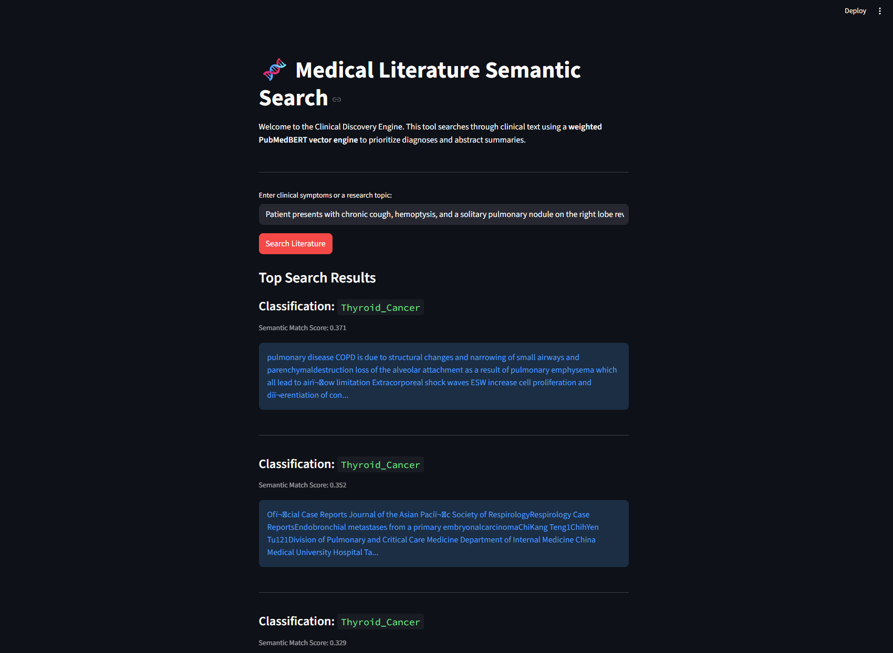

# Clinical-Note-Semantic-Matcher


Built a weighted vector search engine using PubMedBERT and Pinecone. 
Standard semantic search struggles with dense medical documents by treating all words equally. 
To solve this, experimented with a weighted embedding pipeline that prioritizes the clinical diagnosis (5x weight)and abstract summary (3x weight) over the general text body, ensuring that highly relevant medical literature surfaces first.

To run:
1. Clone the repo and install the required dependencies (I'd recommend doing this in a virtual env, but if you have python on PATH that works too):
   ```pip install streamlit sentence-transformers pinecone python-dotenv pandas```
2. PINECONE_API_KEY="your_api_key_here"
3. Run ```streamlit run app.py``` or you can also run the python notebook cells directly
4. Search something

NOTE: The dataset was last updated 4 years ago. This is just a learning project I whipped up to explore domain-specific LLM embeddings and vector weighting.

Sample input: 

Sample output: 

## Evaluation Results of Hybrid Search Trial

| Phase | Method | MRR |                                                                                                                                                                                                                                                                                                                                                                                                        
  |---|---|---|
| Phase 1 | Dense only (PubMedBERT, cosine) | 0.3032 |                                                                                                                                                                                                                                                                                                                                                                          
| Phase 2 | Hybrid BM25 + PubMedBERT (alpha=0.75) | 0.3206 |                                                                                                                                                                                                                                                                                                                                                                    

### Key Finding
Pure keyword search (BM25 alone, alpha=0.0) scored 0.2999, worse than pure semantic
(0.3014). Medical literature rewards semantic understanding over exact keyword matching.                                                                                                                                                                                                                                                                                                                                        
However, a small BM25 contribution (alpha=0.75) recovers failures on exact technical                                                                                                                                                                                                                                                                                                                                            
identifiers like gene names (NAP1L1), protein abbreviations (IL-1), and proprietary                                                                                                                                                                                                                                                                                                                                             
technology names (Ion Torrent) that dense vectors blur together semantically.

The evaluation dataset was auto-generated using gpt-4o-mini: each test query was                                                                                                                                                                                                                                                                                                                                                
grounded in unique details from a specific document, ensuring queries are document-specific                                                                                                                                                                                                                                                                                                                                     
rather than generic. 

MRR measures average reciprocal rank of the correct document across 50 test queries.